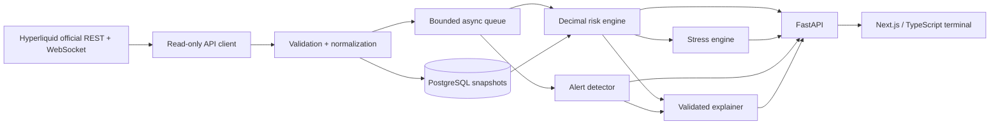
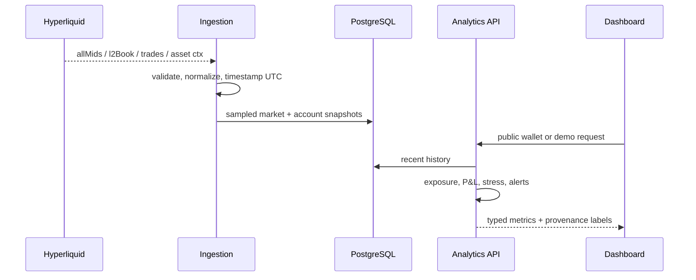

# HyperRisk

**Real-time, read-only risk intelligence for Hyperliquid.** HyperRisk turns public account state and market feeds into explainable exposure, leverage, funding, concentration, liquidation-distance, stress-test, alert, and replay analytics. It never requests a private key and contains no order or exchange endpoint.

> **Safe demo:** the application opens with a deterministic synthetic account, 24 historical snapshots, and a 20-frame BTC order-book replay. Every synthetic value is labelled. Live public-wallet lookup is optional.

## Product tour

The institutional dark terminal includes six keyboard-accessible surfaces:

1. **Overview** — equity curve, risk score, positions, and deterministic risk brief.
2. **Markets** — price, funding, open interest, spread, order-book depth, freshness, latency, reconnects, and queue state.
3. **Portfolio** — long/short/net exposure, effective leverage, funding estimate, concentration, historical equity/exposure, and drawdown.
4. **Stress test** — sliders and presets for price shocks, volatility expansion, correlation assumptions, and funding multipliers.
5. **Alerts** — threshold and rolling z-score signals with the observed value, threshold, method, and non-predictive explanation.
6. **Replay** — deterministic order-book playback at 0.5×–4× with bid/ask, spread, depth, imbalance, and events.

## Architecture





The detailed module boundaries, failure modes, and scaling path are in [ARCHITECTURE.md](ARCHITECTURE.md).

## Quick start

### Docker (recommended)

```bash
cp .env.example .env
docker compose up --build -d postgres api web
docker compose run --rm seed
```

Open `http://localhost:8787`. The API is at `http://localhost:8000`, health at `/health`, readiness at `/ready`, and interactive OpenAPI docs at `/docs`.

### Local development

Requirements: Node.js 22.13+ (24 used in CI), Python 3.11+, and PostgreSQL 15+.

```bash
cp .env.example .env
npm ci
python3 -m venv .venv
.venv/bin/pip install -e 'backend[dev]'

# terminal 1
.venv/bin/uvicorn hyperrisk.main:app --app-dir backend --reload --port 8000

# terminal 2
npm run dev
```

The frontend still works in demo mode if the API or PostgreSQL is unavailable.

## Test and build

```bash
npm run format:check
npm run lint
npm run typecheck
npm test
npm run build

.venv/bin/ruff check backend
.venv/bin/pytest -q backend

# Critical reviewer workflow in desktop + mobile Chromium
npx playwright install chromium
npm run test:e2e
```

## Deterministic seed and replay

```bash
docker compose run --rm seed
# or, with DATABASE_URL configured:
.venv/bin/python -m hyperrisk.seed
```

The seed command writes 24 UTC account snapshots and three market snapshots. Replay data is generated from the stable fixture id `synthetic-btc-l2-2026-08-31`; the same frame and speed always yield the same values and events.

## Risk formulas and provenance

All backend financial arithmetic uses Python `Decimal`, persists to PostgreSQL `NUMERIC`, and quantizes API results to four decimal places.

| Metric                | Formula                                           | Provenance                                       |
| --------------------- | ------------------------------------------------- | ------------------------------------------------ |
| Position notional     | `abs(size) × mark`                                | Local estimate                                   |
| Local unrealized P&L  | `signed size × (mark − entry)`                    | Local; protocol P&L is preferred when returned   |
| Gross exposure        | `Σ abs(position notional)`                        | Local estimate                                   |
| Net exposure          | `long exposure − short exposure`                  | Local estimate                                   |
| Effective leverage    | `gross exposure ÷ account value`                  | Local estimate                                   |
| Concentration         | `asset gross notional ÷ portfolio gross notional` | Local estimate                                   |
| Liquidation distance  | `abs(mark − reported liq price) ÷ mark × 100`     | Local distance using protocol price              |
| Hourly funding impact | `−notional × funding rate × side sign`            | Local estimate; positive funding means longs pay |
| Stress P&L            | `signed size × (stressed mark − current mark)`    | Local estimate                                   |

Stress testing holds size, entry, and reported liquidation prices constant. The optional volatility haircut is 1.5% of gross notional per 100% expansion; the correlation haircut is 1% per 100 percentage-point change. These are transparent product assumptions—not official Hyperliquid margin or liquidation calculations.

## Reliability

- REST requests use timeouts and three attempts with exponential backoff for network errors, `429`, and server errors.
- WebSockets resubscribe after reconnect, use ping/pong health checks, reject malformed frames, cap messages at 1 MiB, and drop the oldest item when the 1,000-message queue is full.
- Connection state records freshness, latency, reconnect count, malformed messages, and dropped messages.
- All timestamps are timezone-aware UTC.
- Alerts use understandable configured thresholds and rolling z-scores; alerts explicitly avoid claims about price prediction.
- The explainer works without an API key. Model-shaped output is schema-validated, fingerprinted to source metrics, checked for fabricated numbers, and rejected if it contains trade recommendations.

## Environment variables

| Variable                  | Required        | Default / purpose                                                   |
| ------------------------- | --------------- | ------------------------------------------------------------------- |
| `NEXT_PUBLIC_API_URL`     | No              | `http://localhost:8000`; public API origin embedded in the frontend |
| `DATABASE_URL`            | For persistence | Async PostgreSQL connection string                                  |
| `HYPERLIQUID_REST_URL`    | No              | Official mainnet REST origin                                        |
| `HYPERLIQUID_WS_URL`      | No              | Official mainnet WebSocket origin                                   |
| `REQUEST_TIMEOUT_SECONDS` | No              | `5`; bounded upstream timeout                                       |
| `STALE_AFTER_SECONDS`     | No              | `10`; freshness warning threshold                                   |
| `CORS_ORIGINS`            | No              | Comma-separated explicit frontend origins                           |
| `OPENAI_API_KEY`          | No              | Optional; template explainer is the default and complete fallback   |

No private-key, mnemonic, signing, or exchange credential variable exists.

## Deployment

The frontend is Cloudflare Worker/Sites compatible through Vinext. The backend Docker image is suitable for Render, Fly.io, Railway, or any container host; use managed PostgreSQL and set the environment variables above.

1. Deploy PostgreSQL and copy its TLS-enabled async URL to `DATABASE_URL`.
2. Deploy `backend/Dockerfile`; verify `/health` and `/ready`.
3. Run `python -m hyperrisk.seed` as a one-off job.
4. Set `NEXT_PUBLIC_API_URL` to the HTTPS API URL and deploy `Dockerfile.frontend` or run the Sites build.
5. Set `CORS_ORIGINS` to the exact frontend HTTPS origin.
6. Exercise the seeded demo before enabling live public-wallet lookup in the UI.

## Security and privacy

HyperRisk only reads public addresses. It does not authenticate wallets, store keys, sign payloads, call the Hyperliquid exchange endpoint, or submit trades. Inputs are allow-listed, errors are structured, CORS is explicit, containers run unprivileged, and response hardening headers are applied. See [SECURITY.md](SECURITY.md).

## Tradeoffs and limitations

- The MVP samples market and account snapshots rather than storing every tick. Redis was deliberately omitted: the bounded in-process queue is sufficient for one ingestion process, and adding Redis before horizontal scaling would not improve correctness.
- Live funding rates are joined from asset contexts in the ingestion design; the minimal public-wallet REST path uses zero when the field is unavailable rather than inventing a value.
- Liquidation risk is a distance indicator, not a reimplementation of Hyperliquid’s margin engine.
- The optional AI transport is intentionally not enabled by default; the deterministic explainer is the production fallback.
- Historical demo data and replay frames are synthetic and clearly labelled.
- No deployment credentials were included in the repository.

## Documentation

- [Architecture](ARCHITECTURE.md)
- [Security policy](SECURITY.md)
- [Contributor guide](CONTRIBUTING.md)
- [API contract](docs/API.md)
- [Two-minute interview demo](docs/DEMO_SCRIPT.md)
- [Screenshot workflow](docs/SCREENSHOTS.md)

## Primary technical references

- [Hyperliquid WebSocket subscriptions](https://hyperliquid.gitbook.io/hyperliquid-docs/for-developers/api/websocket/subscriptions)
- [Hyperliquid perpetuals info endpoint](https://hyperliquid.gitbook.io/hyperliquid-docs/for-developers/api/info-endpoint/perpetuals)
- [Hyperliquid rate limits](https://hyperliquid.gitbook.io/hyperliquid-docs/for-developers/api/rate-limits-and-user-limits)
- [Hyperliquid funding](https://hyperliquid.gitbook.io/hyperliquid-docs/trading/funding)
- [Official Hyperliquid Python SDK](https://github.com/hyperliquid-dex/hyperliquid-python-sdk)

## Roadmap

- Partitioned Timescale/PostgreSQL retention policies for long-running ingestion.
- User-defined alert thresholds with notification destinations.
- Multi-dex portfolio aggregation using `allDexsClearinghouseState`.
- OpenTelemetry traces and Prometheus metrics for ingestion SLOs.
- Authenticated saved watchlists without ever adding trade permissions.

MIT licensed. HyperRisk is an independent analytics project and is not affiliated with Hyperliquid. It is not financial advice.
